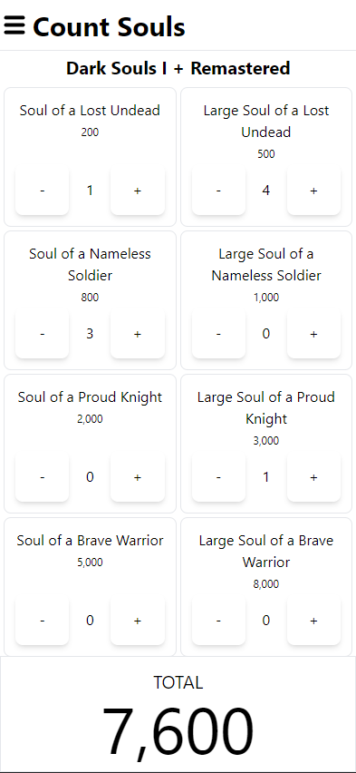

# Count Souls

<details>
  <summary>Screenshot (click to reveal)</summary>
  
  

</details>

A simple web app to quickly calculate the number of souls you have in your inventory.

Supports:

- Demon Souls + Remake
- Dark Souls Remastered
- Dark Souls II
- Dark Souls III
- Sekiro
- Bloodborne
- Elden Ring

## Tech stack

- [SvelteKit](https://kit.svelte.dev/)
- [Tailwind](https://tailwindcss.com/)
- [TypeScript](https://www.typescriptlang.org/)
- and a little bit of :heart: for Souls

The project is hosted by [Cloudflare Pages](https://pages.cloudflare.com/) and deploys the latest changes in the `main` branch to [countsouls.com](https://countsouls.com/)

## Getting up and running

Clone the project, and run good old:

```
npm install
```

To run locally (and on your local network):

```
npm run dev
```

For a full list of commands, see [package.json](./package.json)

## Limitations

- No dark mode

## Support

You can press that pretty-looking button below, but I will always settle for a thank you! :)

[](https://ko-fi.com/C0C8O3SFV)
